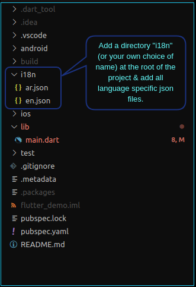
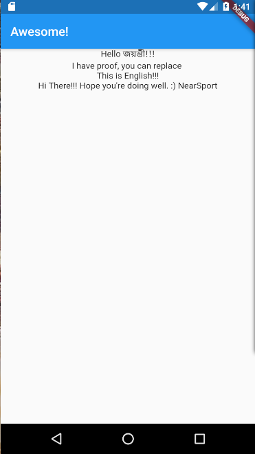
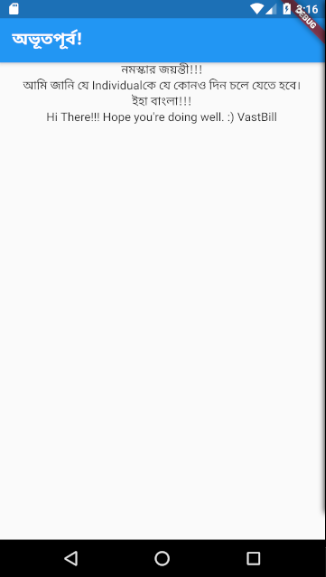
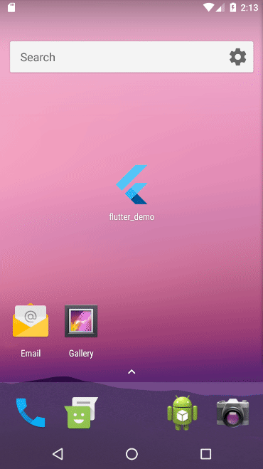

# applocale
A Flutter plugin to enable support for internationalization (i18n) or different language with json files.

## Usage

A simple usage example:

### Project Structure


#### lang.json contents
```json
//en.json
{
  "title": "Awesome!",
  "hello": "Hello",
  "message": "This is English!!!",
  "subDetail": {
    "greeting": "{hello} {name}!!!",
    "runtimeText": "I have proof, you can replace {replacement}"
  }
}

//bn.json
{
  "title": "অভূতপূর্ব!",
  "hello": "নমস্কার",
  "message": "ইহা বাংলা!!!",
  "subDetail": {
    "runtimeText": "আমি জানি যে {replacement}কে যে কোনও দিন চলে যেতে হবে।"
  }
}
```

#### Add the language directory as assets in pubspec.yaml
```yaml
# pubspec.yaml
# add dependencies
dependencies:
  applocale: <latest-version>

flutter:
  # add the whole directory containing language json files as an asset
  assets:
    - i18n/

```

#### Now the code
```dart
// main.dart
import 'package:flutter/material.dart';
import 'package:flutter/widgets.dart';

import 'package:applocale/applocale.dart';
import 'package:flutter_localizations/flutter_localizations.dart';

// define supported Language lists
var get _supportedLanguages => ["en", "en_us", "bn"];
var get _defaultLanguage => "en";

void main(List<String> args) => runApp(FlutterDemoApp());

class FlutterDemoApp extends StatefulWidget {
  @override
  _FlutterDemoApp createState() => _FlutterDemoApp();
}

class _FlutterDemoApp extends State<FlutterDemoApp> {
  LocaleDelegate _localeDelegate;
  
  @override
  void initState() {
    super.initState();
      // initialize _localeDelegate
    _localeDelegate = LocaleDelegate.init(_supportedLanguages, _defaultLanguage);
  }

  @override
  Widget build(BuildContext context) => MaterialApp(
        supportedLocales: _localeDelegate.supportedLocales, // Step I
        localizationsDelegates: [
          _localeDelegate, // Step II
          GlobalMaterialLocalizations.delegate,
          GlobalWidgetsLocalizations.delegate
        ],
        title: 'Flutter Demo',
        home: FlutterDemo(),
      );
}

class FlutterDemo extends StatelessWidget {
  @override
  Widget build(BuildContext context) {
    // since LocaleDelegate is already initialized & ready
    var appLocale = LocaleDelegate.of(context); // Step III
    // In case some additional values can be set now
    appLocale.updateValue({'name': 'জয়ন্তী'});

    return Scaffold(
      appBar: AppBar(title: Text(appLocale.localValue('title'))),
      body: ListView(
        children: <Widget>[
          Center(child: Text(appLocale.localValue('subDetail.greeting'))),
          Center(child: Text(
            appLocale.localValue('subDetail.runtimeText', {'replacement': 'Individual'}))),
          Center(child: Text(appLocale.localValue('message'))),
        ],
      ),
    );
  }
}
```

### Project Structure


*App with English*  > *Change system language* > *App with Bengali*



## Features and bugs

Please file feature requests and bugs at the [issue tracker][tracker].

[tracker]: https://github.com/Terran-Source/applocale/issues
